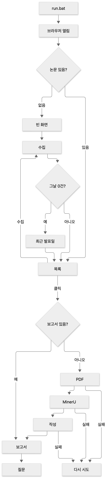

# PaperBrief 브리프

HF Daily Papers에서 논문 한 편을 고르면, 원문 그림과 재현 체크가 들어간 보고서를 만들어 주는 로컬 웹앱의 **브리프와 화면 설계**.

<details>
<summary>동작 흐름</summary>



</details>

## 구성

| 파일 | 내용 |
|---|---|
| [`brief.md`](brief.md) | 무엇을 왜 만드는지, 동작, 확정된 스택·결정, 용어, 범위 밖 |
| [`wireframe.html`](wireframe.html) | 화면 와이어프레임. 브라우저로 열어서 본다 |
| [`wireframe-flow.mmd`](wireframe-flow.mmd) | 동작 흐름 (Mermaid 원본) |
| [`.env.example`](.env.example) | 앱 설정 템플릿. `.env`로 복사해서 쓴다 |
| [`.claude/skills/codex-pr-review`](.claude/skills/codex-pr-review/SKILL.md) | Codex PR 리뷰를 받아 P0·P1을 고쳐 push하는 Claude Code 스킬 |

## 시작

1. `brief.md`를 읽는다.
2. `wireframe.html`을 브라우저로 연다.
3. 구현은 `brief.md`의 "개발 환경" 절차를 따른다 (`/to-spec` → `/implement-spec` → `codex-pr-review`).

## 스킬 테스트

```
python -m pytest .claude/skills/codex-pr-review/scripts
```
